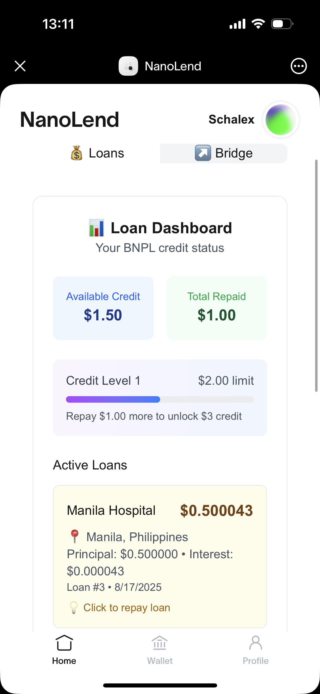
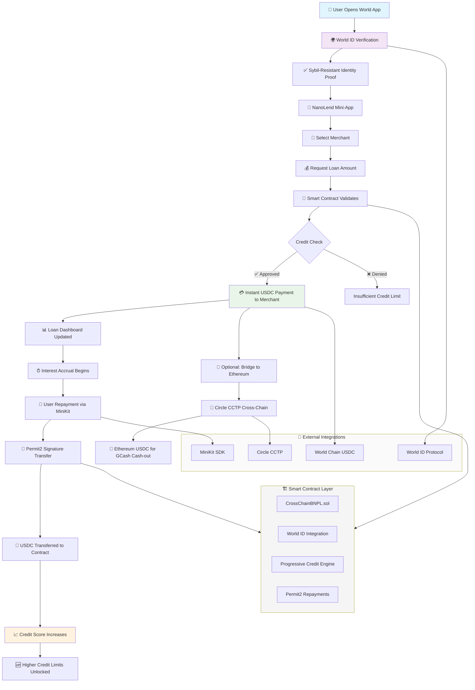
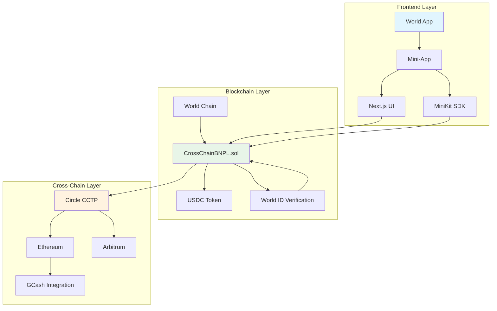
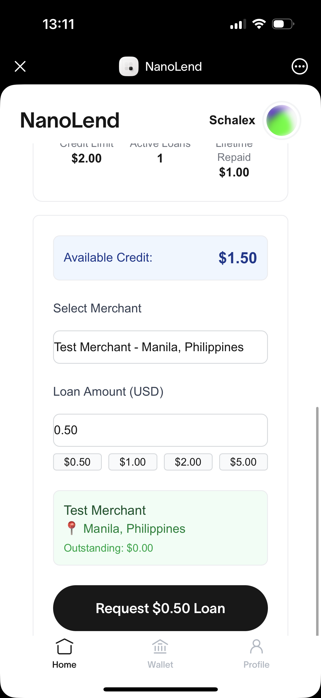
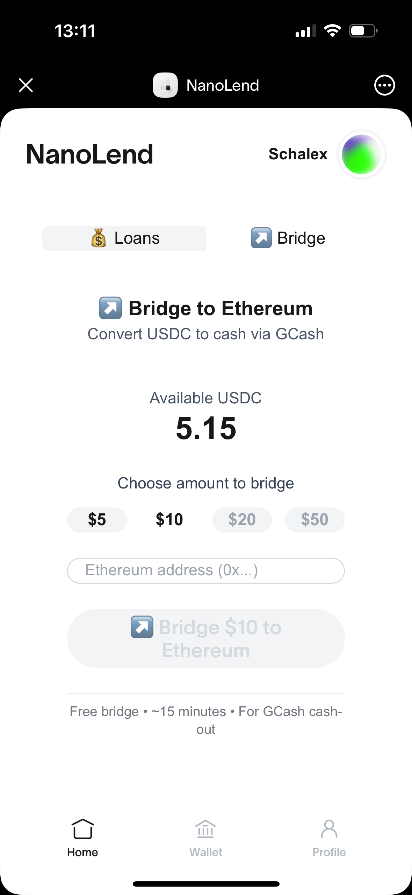
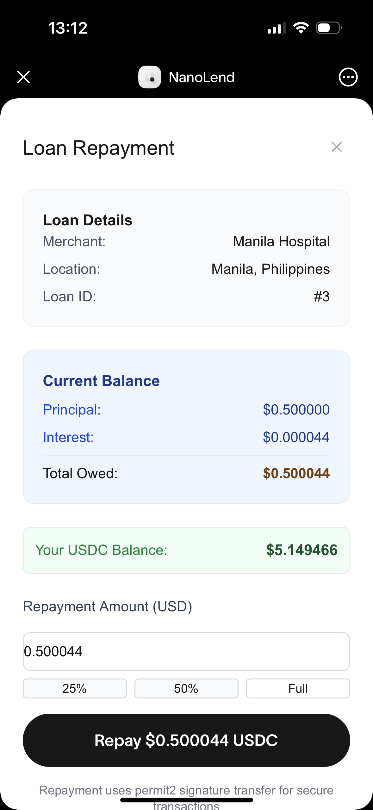

# NanoLend Global - Proof of Identity, Not Proof of Wealth

**ETH Global NYC 2025 Hackathon Project**

A revolutionary BNPL (Buy Now, Pay Later) platform that uses World ID verification instead of traditional credit scores. Built from scratch in 48 hours to bring financial inclusion to 1.4 billion unbanked people through blockchain-native identity verification.



## 🎯 Core Innovation

- **World ID Verification**: Sybil-resistant identity without banking history requirements
- **Multi-Chain Ready**: World Chain live, Ethereum + Solana expansion planned
- **Progressive Credit**: Dynamic limits that grow with repayment history
- **Mobile-First Design**: Optimized for World App ecosystem
- **Philippine Market Focus**: 1.3M sari-sari stores + 81M GCash users

## 🏗️ Architecture

### System Flow



### Technical Architecture



### System Components

```
Current Implementation (World Chain)
├── CrossChainBNPL.sol - Main lending contract
├── World ID verification & sybil resistance
├── Progressive credit scoring algorithm
└── MiniKit integration for World App

Planned Expansion
├── Ethereum - Cross-chain repayment via Circle CCTP
├── Solana - Ultra-low cost transactions
└── Philippines - Sari-sari store integration via GCash
```

## 🚀 Quick Start

### Prerequisites

- [Foundry](https://book.getfoundry.sh/getting-started/installation) for smart contracts
- Node.js 18+ for the mini-app frontend
- World App for mobile testing

### Smart Contract Setup

```bash
# Install Foundry dependencies
forge install

# Run comprehensive test suite
forge test

# Deploy to World Chain
forge script script/DeployCrossChainBNPL.s.sol:DeployCrossChainBNPL --rpc-url $WORLD_CHAIN_RPC_URL --broadcast
```

### Mini-App Setup

```bash
# Navigate to mini-app
cd src/mini-app

# Install dependencies
npm install

# Start development server
npm run dev

# Build for production
npm run build
```

### Environment Setup

```bash
# Smart Contract Environment
cp .env.example .env
# Add: PRIVATE_KEY, WORLD_CHAIN_RPC_URL, etc.

# Mini-App Environment
cd src/mini-app
cp .env.local.example .env.local
# Add: NEXT_PUBLIC_CONTRACT_ADDRESS, NEXT_PUBLIC_WORLD_ID_APP_ID, etc.
```

## 📋 Smart Contract

### Core Contract: `CrossChainBNPL.sol`

**Key Functions:**

- `requestLoan()` - Request loan with World ID verification and merchant payment
- `repayLoan()` - Repay loans with progressive credit building
- `registerMerchant()` - Admin function to onboard merchants with location data
- `getUserDashboardData()` - Get user's credit info and active loans
- `getCurrentBalance()` - Calculate loan balance with interest

**World ID Integration:**

- Sybil-resistant verification using nullifier hashes
- Privacy-preserving proof of humanhood
- No KYC or traditional credit requirements

### Testing

```bash
# Run all tests (95%+ coverage)
forge test

# Run with verbosity
forge test -vvv

# Run specific test
forge test --match-test testRequestLoan

# Gas usage analysis
forge test --gas-report

# Test progressive credit system
forge test --match-test testCreditProgression
```

## 📱 Mini-App Usage

### 1. Live Demo Flow

1. **Open World App** and navigate to NanoLend Global
2. **Select Merchant** from registered merchants (e.g., Manila Hospital)
3. **World ID Verification** - Prove humanhood without revealing identity
4. **Instant Loan Approval** - Smart contract pays merchant immediately
5. **View Dashboard** - Real-time credit tracking and loan management
6. **Easy Repayment** - MiniKit integration for seamless payments

### 📸 Application Screenshots

#### Loan Dashboard


_Real-time BNPL credit status with available credit, total repaid, and active loans tracking_

#### Loan Request Interface


_World ID verified loan requests with merchant selection and instant approval_

#### CCTP Bridge to Ethereum


_Cross-chain USDC bridging for Philippines GCash cash-out via Circle CCTP_

#### Loan Repayment Flow


_Seamless loan repayment with MiniKit integration and progressive credit building_

### 2. Smart Contract Interaction

```solidity
// Request loan with World ID verification
bnpl.requestLoan(
    merchantAddress,
    500000, // $0.50 USDC (6 decimals)
    "username",
    worldIdNullifier,
    0, // WORLD_CHAIN_DOMAIN
    merchantAddress
);

// Repay loan (updates credit score)
bnpl.repayLoan(loanId);

// Check user dashboard
bnpl.getUserDashboardData(userAddress);
```

### 3. Merchant Management

```bash
# Register new merchant
./manage.sh register-merchant 0x... "Manila Hospital" "Manila, Philippines" "+63123456789"

# Check merchant profile
./manage.sh get-merchant 0x...

# List all merchants
./manage.sh list-merchants
```

## 🔗 Contract Addresses

### World Chain Mainnet

- **CrossChainBNPL**: See `.env.local` file
- **USDC**: `0x79A02482A880bCE3F13e09Da970dC34db4CD24d1`
- **World ID Router**: Integrated via World SDK

### Planned Networks

- **Ethereum**: For cross-chain repayment via Circle CCTP
- **Solana**: For ultra-low cost transactions
- **Philippines Integration**: Via GCash onramp infrastructure

## 🏆 ETH Global NYC 2025 Results

### What We Built in 48 Hours

- **Production Smart Contracts**: CrossChainBNPL.sol with 95%+ test coverage
- **Mobile-First Frontend**: World App optimized with real-time dashboards
- **Live World ID Integration**: Functional sybil-resistant verification
- **Philippine Market Research**: 1.3M sari-sari stores + 81M GCash users analysis

### Technical Achievements

- **Built from Scratch**: Complete system architected and implemented during hackathon
- **Production Quality**: Comprehensive error handling, security patterns, gas optimization
- **Mobile Excellence**: Seamless World App integration with MiniKit
- **Real Market Validation**: Advanced discussions with Asian Development Bank

## 📊 Key Features

### For Users (Current)

- **World ID Verification**: Prove humanhood without revealing personal data
- **Progressive Credit**: Start with $2 limit, grow with repayment history
- **Mobile-First UX**: Optimized for World App ecosystem
- **Real-Time Tracking**: Live dashboard with credit score and loan status

### For Merchants (Current)

- **Simple Registration**: Admin onboarding with location and contact data
- **Instant Settlement**: Direct USDC payment on World Chain
- **Zero Integration**: No complex APIs or payment processing
- **Philippine Focus**: Targeting 1.3M sari-sari stores initially

### Future Expansion

- **Multi-Chain Repayment**: Circle CCTP integration for Ethereum/Solana
- **Enhanced Onboarding**: Coinbase CDP embedded wallets
- **Geographic Scaling**: Southeast Asia, Africa, Latin America
- **AI Credit Scoring**: ML-powered risk assessment algorithms

## 🛠️ Development

### Project Structure

```
nanolend-global/
├── src/
│   └── CrossChainBNPL.sol          # Main BNPL contract
├── test/
│   └── CrossChainBNPL.t.sol        # 95%+ test coverage
├── script/
│   ├── DeployCrossChainBNPL.s.sol  # Deployment script
│   └── ManageCrossChainBNPL.s.sol  # Management utilities
├── src/mini-app/                   # Next.js World App
│   ├── src/components/             # React components
│   ├── src/auth/                   # World ID integration
│   └── src/types/                  # TypeScript definitions
├── presentation/                   # Hackathon pitch slides
└── manage.sh                       # CLI management tool
```

### Key Design Decisions

- **World Chain First**: Production deployment on World Chain mainnet
- **Mobile-Optimized**: World App ecosystem integration with MiniKit
- **Progressive Credit**: Dynamic limits that grow with repayment history
- **Production Security**: OpenZeppelin patterns, comprehensive testing, emergency controls
- **Market-Focused**: Philippine sari-sari store integration strategy

## 📊 Hackathon Presentation

The team presented this project to ETH Global NYC 2025 judges with a comprehensive slide deck.

### View Presentation

```bash
# Install Marp CLI
npm install -g @marp-team/marp-cli

# Generate presentation
cd presentation
marp nanolend-global-eth-global-nyc.md --html

# View presentation
open nanolend-global-eth-global-nyc.html
```

**Presentation Highlights:**

- "Proof of Identity, Not Proof of Wealth" - Core value proposition
- Philippine market focus: 1.3M sari-sari stores + 81M GCash users
- Live demo of World ID verification and BNPL flow
- Technical achievements and future roadmap

---

**Built with ❤️ for financial inclusion at ETH Global NYC 2025**  
**"Giving humanity the benefit of the doubt" 🚀**
